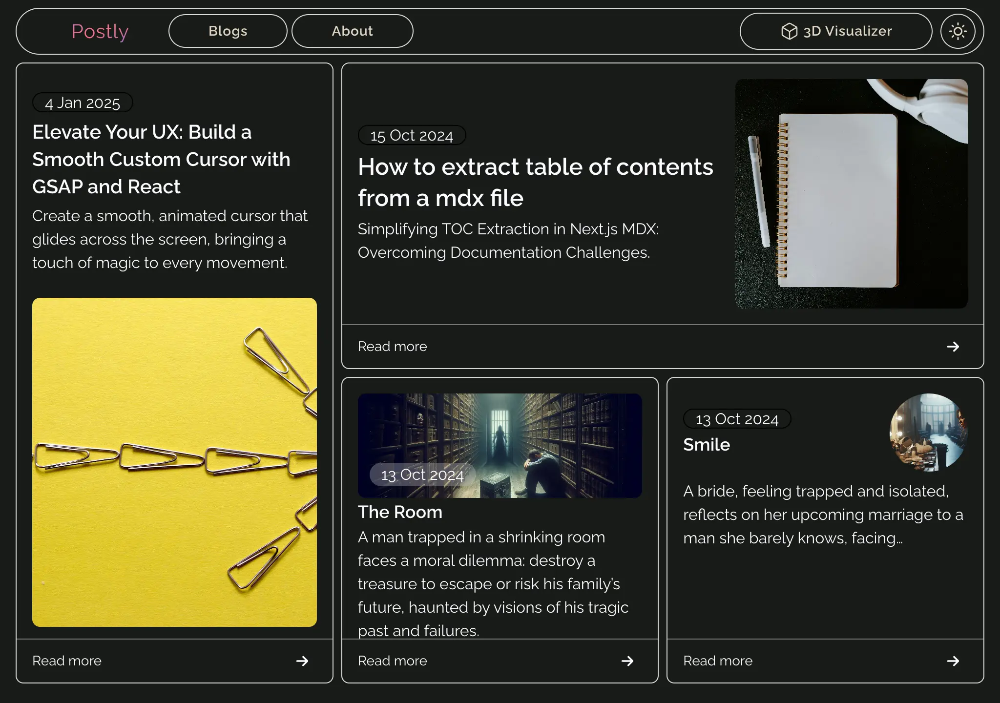

Postly is a creative personal blogging platform built with **Next.js** and styled using **Tailwind CSS**. It uses **MDX** and **Velite** for content management, enabling dynamic, component-rich writing.

The site features an engaging user interface with animated elements and a custom cursor, delivering a modern and interactive experience. **React Three Fiber** is used to enhance the homepage with subtle 3D visuals that bring depth and personality to the design.

## 🛠️ Tech Stack

- **Next.js** – For optimized, server-rendered React applications
- **Tailwind CSS** – Utility-first styling with full responsiveness
- **MDX** – Combine Markdown and React for flexible content
- **Velite** – Lightweight content layer for managing blog posts
- **React Three Fiber** – Interactive 3D graphics and animations

## ✨ Highlights

- Dynamic 3D landing page
- Animated transitions and custom cursor
- Blog posts written with MDX and enhanced with React components
- Deployed on **Vercel** for performance and scalability

Postly blends creativity and technical depth to showcase how modern web technologies can be used to craft a personalized, interactive blog.
