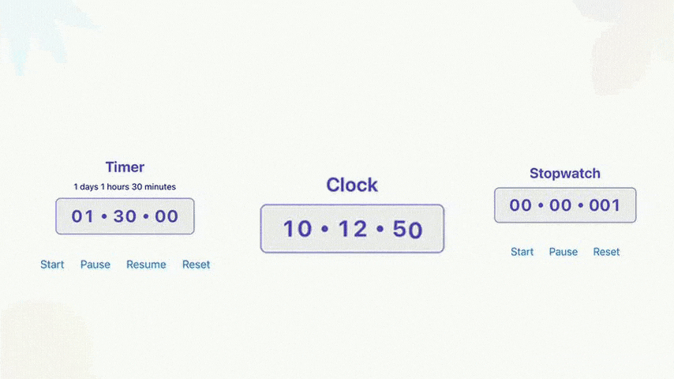

**react-native-reanimated-chrono** is a flexible and high-performance timekeeping library for React Native, built with **Reanimated v3** and fully compatible with **Expo**. It provides smooth **60FPS animations** and a polished user experience out of the box.

## Components

This package includes three core components:

- **Timer** – Countdown timer with customizable duration, appearance, and animated progress.
- **Stopwatch** – Precise stopwatch functionality with start, stop, and reset controls.
- **Clock** – Real-time animated clock that reflects the current system time.

## Customization

Each component is fully customizable via props, allowing you to control layout, styling, and behavior with ease. Seamless **entry and exit animations** let you integrate time-based UI naturally into your app.

## Built for TypeScript

Designed with **TypeScript** from the ground up, `react-native-reanimated-chrono` ensures type safety and an improved developer experience.

## Use Cases

Whether you’re building **fitness apps**, **productivity tools**, or **real-time dashboards**, this package provides the time-based components you need — with **performance and flexibility** at its core.